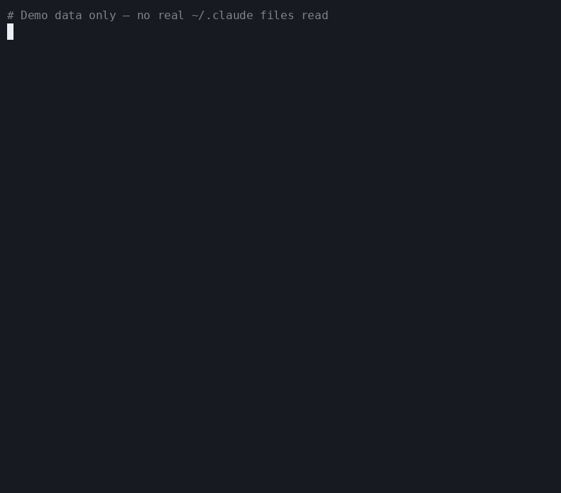

<div align="center">

# optimize

[](LICENSE)
[](skills/skill-optimize/SKILL.md)
[](scripts/audit.py)
[](#install)
[](#requirements)
[](#safety)

**Hit Claude Code's usage limits less often by cutting dead-weight skill context from every prompt.**

Every installed skill injects its description into every turn — even skills you haven't touched in months. `/skill-optimize` scans your session history, finds unused skills, and quietly mutes them. Fewer wasted tokens per turn means your daily usage limit goes further.

</div>

## Demo

<div align="center">



</div>

Sample output — shows the full flow: Phase 1 (user skills) with confirmation prompt, then Phase 2 (plugins) with per-plugin confirmation. No real `~/.claude` data shown.

## Why this exists

Every Claude Code skill adds its description to the model context on every turn. You pay that token cost whether or not you use the skill. With a handful of skills the overhead is negligible — but as your library grows, unused skills quietly spend hundreds or thousands of tokens on every single prompt, pushing you toward your usage limit faster.

`optimize` helps you answer:

- Which skills have I actually used recently?
- Which can be hidden without uninstalling them?
- How many tokens am I wasting per turn?
- Which plugin skills appear completely unused?

Savings depend on your skill count and description sizes. Even a modest trim can meaningfully extend how long your daily limit lasts.

## How it works

`/skill-optimize` runs a local audit over your Claude Code data:

1. Reads installed user skills from `~/.claude/skills/`.
2. Reads enabled plugin skills from Claude Code plugin cache.
3. Scans recent session history in `~/.claude/projects/**/*.jsonl`.
4. Counts direct slash-command usage and Skill tool invocations.
5. Groups user skills as:
   - `dead`: 0 uses in the lookback window, proposed as `off`
   - `situational`: 1-2 uses, proposed as `name-only`
   - `kept`: 3+ uses, left unchanged
6. Shows estimated token savings before changing anything.
7. Asks for confirmation before writing to `~/.claude/settings.json`.

Plugin skills are reported separately because Claude Code does not expose them through `skillOverrides` in the same way as user skills. If a plugin appears completely unused, the workflow can ask whether to disable that plugin.

## Install

```bash
curl -fsSL https://raw.githubusercontent.com/codeprakhar25/optimize/main/install.sh | bash
```

Restart Claude Code, then run:

```text
/skill-optimize
```

## Requirements

- Claude Code with skills enabled
- Python 3
- `curl` for the installer
- A Unix-like shell environment

No Python packages are required.

## Usage

```text
/skill-optimize
```

The workflow will:

- scan the last 60 days of Claude Code session history
- estimate token savings from hiding unused skill context
- show separate summaries for user skills and plugin skills
- ask whether to apply all recommendations, review them, skip, or cancel
- create a backup before writing any changes

Nothing is changed until you explicitly confirm.

## What Gets Changed

For user skills, `optimize` updates `skillOverrides` in:

```text
~/.claude/settings.json
```

Example:

```json
{
  "skillOverrides": {
    "rarely-used-skill": "name-only",
    "unused-skill": "off"
  }
}
```

For fully unused plugins, `optimize` may update `enabledPlugins` only after a separate confirmation.

## Modes

| Mode | Meaning | When it is used |
| --- | --- | --- |
| `name-only` | Keep the skill available, but remove its description from the prompt | Skills used rarely |
| `off` | Hide the skill from Claude Code context | Skills with no detected recent usage |
| unchanged | Leave the skill exactly as it is | Skills used regularly or protected by your config |

## Undo

Every apply creates a timestamped backup of `~/.claude/settings.json`.

Restore the latest backup:

```bash
python3 ~/.claude/skills/skill-optimize/scripts/restore.py
```

List available backups:

```bash
python3 ~/.claude/skills/skill-optimize/scripts/restore.py --list
```

Restore a specific backup:

```bash
python3 ~/.claude/skills/skill-optimize/scripts/restore.py --backup settings.json.bak-YYYY-MM-DDTHH:MM:SS
```

Restart Claude Code after restoring.

## Manual Alternative

For one-off changes, you can use Claude Code's built-in skill picker:

1. Run `/skills`.
2. Highlight a skill.
3. Press `Space` to cycle between `on`, `name-only`, and `off`.
4. Press `Enter` to save.

Use the manual flow when you already know which skill to change. Use `/skill-optimize` when you want an audit based on usage history.

## Safety

- Fully local: session history is read from disk and is not sent anywhere.
- Reversible: settings are backed up before every write.
- Reviewable: recommendations are shown before they are applied.
- Conservative defaults: rarely used skills are moved to `name-only`, not immediately disabled.
- Protected skills: skills referenced in `~/.claude/CLAUDE.md` are kept.
- Write lock: concurrent runs are guarded by a lock file.

## Risks and Limits

The audit is based on detectable usage — slash commands and Skill tool calls found in your session history. Review recommendations before applying.

**Implicit usage may be missed.** If Claude invoked a skill automatically (its description matched your prompt) without an explicit slash command, the audit counts it as zero. Keep borderline skills at `name-only` rather than `off`.

**Fresh installs have thin history.** If you've barely used Claude Code yet, everything looks unused. Wait a few days, then re-run.

**Plugin disables are broader.** Turning off a plugin removes *all* its skills and agents — not just one. Plugin changes are always shown separately and need their own confirmation.

**Token savings are estimates.** Calculated from description lengths, not Claude's internal tokenizer. Treat the number as a directional guide, not an exact figure.

**Your prompts are read locally.** The audit reads `.jsonl` session files on disk. Nothing is sent anywhere — all processing stays on your machine.

If a skill you need becomes hidden, restore from backup or re-enable it with `/skills`.

## Uninstall

```bash
rm -rf ~/.claude/skills/skill-optimize
```

Uninstalling removes the `skill-optimize` command. It does not remove any `skillOverrides` already written to `~/.claude/settings.json`; use the restore command first if you want to undo applied changes.

## Development

Run the audit script directly:

```bash
python3 scripts/audit.py --days 60
```

Emit JSON:

```bash
python3 scripts/audit.py --days 60 --json
```

The project is intentionally small:

- `skills/skill-optimize/SKILL.md`: Claude Code workflow
- `scripts/audit.py`: usage audit and token estimate
- `scripts/apply.py`: settings patcher with backup and lockfile
- `scripts/restore.py`: backup restore helper
- `scripts/record-demo.sh`: regenerate the README demo GIF
- `install.sh`: curl installer

## License

[MIT](LICENSE)
